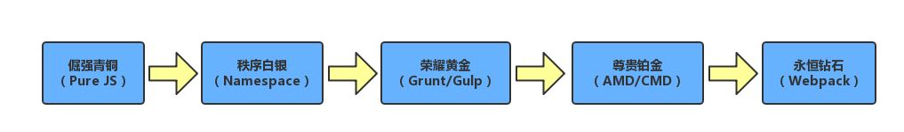
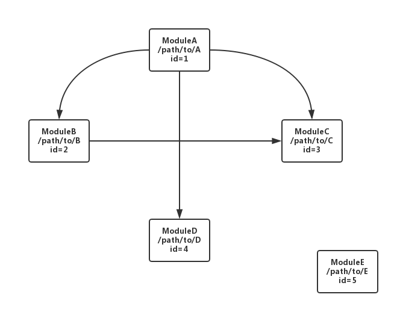
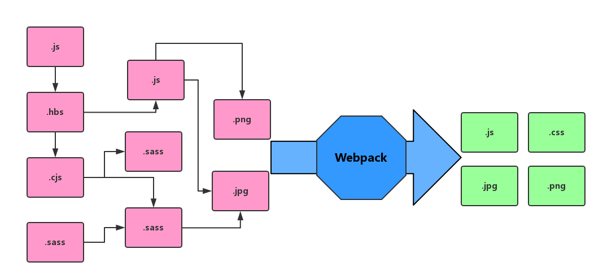
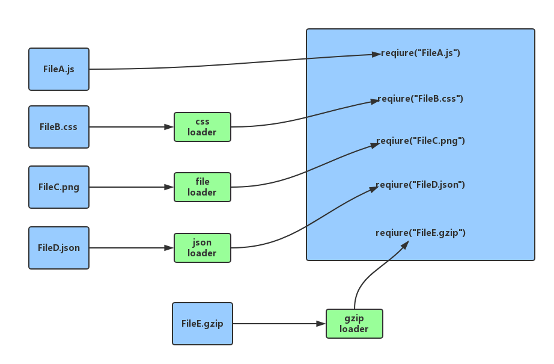
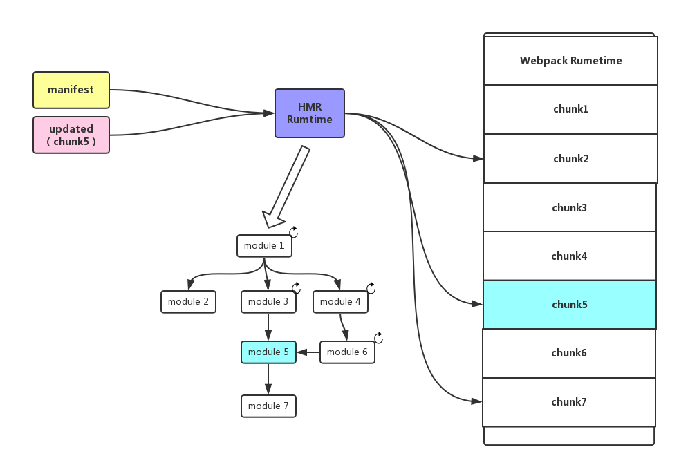
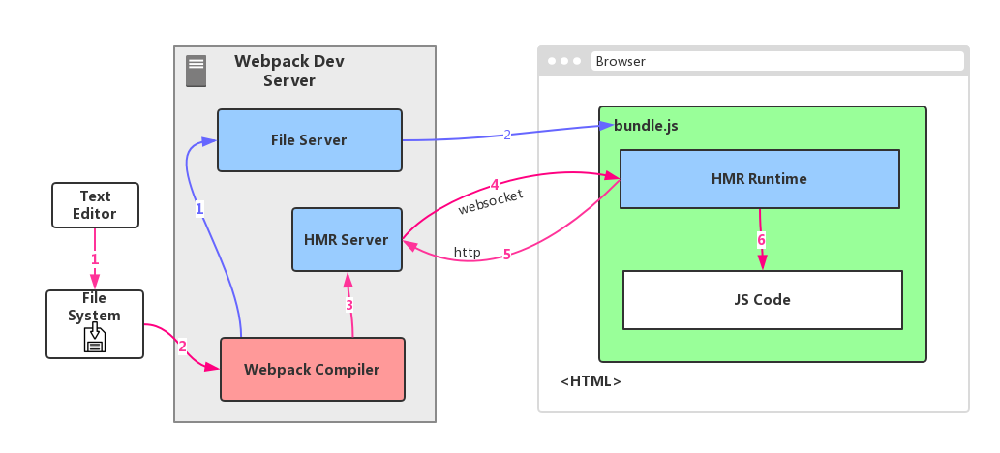

# 为什么？
经历了纯手工、自定义脚本，到后来的grunt/gulp，前端自动化工具来到了Webpack时代。Webpack是目前使用最广泛的前端打包工具，之所以能提到之前的grunt/gulp类的自动化构建工具，是因为它不仅解决了前端工程化中“自动化”这个问题，更很好的解决了“模块化”这个问题。

前端模块化经历了从全局变量满天飞、命名空间的时代，终于来到了模块化时代，模块化的带来是可以说是前端工程化的至关重要一步。



项目中，我们经常拿着脚手架或各种cli工具生成的Webpack配置，就开始项目的开发的构建了，几乎不太需要理解Webpack的技术细节。但是当我们需要针对项目工程进行定制的时候，看着复杂的配置，就束手无策了。知其然，还得知其所以然，否则就没法完全驾驭好你的工具。Webpack的官方文档对其原理也有非常详尽的描述，本文尝试用更直观的方式对Webpack工作原理进行分析和总结。

# 模块化
早期的js并不是一个支持模块化的语言，为了提高js工程的可维护性和可复用性，模块化是前端工程化的必要一步。于是出现了很多第三方js模块化工具，比较典型的有CommonJS、AMD、CMD等，在es6中也出现了官方的模块化支持。

无论什么js模块化工具，核心做的事情主要就两个：代码封装和依赖管理。以CommonJS为例，我们用下面的简单代码来示例（以下示例和实现只是为了方便演示的简化版本，并不代表webpack的真实实现，但是原理都是类似的）：

``` javascript
// foo.js
module.exports = function() {
    console.log('foo');
};

// bar.js 
module.exports = function() {
    console.log('bar');
}

// main.js
var foo = require("./foo");
var bar = require("./bar");

foo();
bar();
```

## 代码封装

上面的示例代码中我们可以看到，有几个变量（函数）是浏览器不存在的。他们是`module`，`exports`，`require`，那么模块化工具首先需要实现这几个变量并添加到模块代码中，以`foo.js`为例，包装后的代码可能如下：

``` javascript

define('foo.js', function(module, exports, require) {
// +++++ begin of original foo.js +++++
module.exports = function() {
     console.log('foo');
};
// +++++ end of original foo.js +++++
);

```
然后再实现好关键的`define`和`require`两个函数，就可以实现基本的模块代码封装了。这里我们思路也很简单，定一个全局对象存储模块名到具体模块实现代码的映射，这样:
* `define`函数就负责根据模块名将模块代码加载到该全局对象。
* `require`函数负责从模块映射中查找模块代码并将其exports的变量返回给引用模块。

``` javascript
var modules = {

};

function define(name, fn) {
    modules[name] = fn
};

function require(name) {
    var mod = modules[name];
    if (!mod) throw new Error('failed to require "' + name + '"');
    if (!mod.exports) {
        mod.exports = {};
        mod.call(mod.exports, 
            mod, mod.exports, require);
    }
    return mod.exports;
};
```

将上面的定义和包装后的模块代码合并到一个文件，并执行我们的入口模块，最后我们的`bundle.js`就如下了：

``` javascript
var modules = {

};

function define(name, fn) {
    ...
};

function require(name) {
    ...
};

define('./foo.js', function(module, exports, require) {
// +++++ begin of original foo.js +++++
module.exports = function() {
     console.log('foo');
};
// +++++ end of original foo.js +++++
);

define('./bar.js', function(module, exports, require) {
// +++++ begin of original foo.js +++++
module.exports = function() {
     console.log('foo');
};
// +++++ end of original foo.js +++++
);

define('./main.js', function(module, exports, require) {
// +++++ begin of original foo.js +++++
var foo = require("./foo.js");
var bar = require("./bar.js");

foo();
bar();
// +++++ end of original foo.js +++++
);

require('./main.js')
```

哇，就是这么简单，就实现了模块封装的核心思想，No more magic :-）

## 依赖管理

上面的代码有几个重要问题没有得到很好的解决：

1. 我们引用模块的时候很多时候都是采用相对路径，不同模块甚至不在同一个目录，怎么区分呢？
2. 假如模块并没有引用，我们也都打进bundle岂不是浪费么？
3. 如果一个模块被多个模块引用，怎么避免被重复打包？

所以打包工具还要去分析模块间的引用关系，在进行代码封装前，先解析出如下所示的依赖关系，一般称作依赖图。



这里的解析方法也比较简单，从我们的入口文件（一个或多个）开始分析其require，通过递归（深度优先）或者迭代（广度优先），最终遍历出完整的依赖关系图。

1. 对于上面说的第一个问题，在遍历相对路径的过程中可能会将模块路径先转换为绝对路径，并给模块分配一个唯一的id以示区分。
2. 对于没有引用的模块，可以看到并不会被遍历到，所以不需要打包。
3. 由于遍历时我们给模块分配了唯一id（如模块文件绝对路径或文件hash值），如果模块已经被标记我们也不会重复遍历。

# 扩展模块的边界
前面的这些模块化工具之解决了js代码的模块化，但是在前端项目中，我们除了js还有各种其他资源，如html模板、css代码、甚至一些json配置文件、图片等，如果能把这些资源都通过类似模块的方式管理起来，岂不美哉？Webpack就是基于这个（创新的）想法应运而生了！



为此，对于以上的模块化的扩充，webpack提出了Loader的概念来实现：

由于模块本身只支持JavaScript，Webpack的loader相当于一个中间层，一个loader可以接收一种指定类型的文件，将其转化为js模块以供其他j模块使用。



Webpack官方以及非官方提供了几十上百种Loader，可以将各种类型的文件都转换成js模块来使用，这也是Webpack最好用的特性之一。

这里以一个比较简单的Loader `json-loader` 源码为例，我们可以看到一个Loader是如何实现的:

``` javascript
// 所谓 loader 只是一个导出为函数的 JavaScript 模块。loader runner 会调用这个函数，然后把上一个 loader 产生的结果或者资源文件(resource file)传入进去
module.exports = function (source) {
  // 参数source是文件的字符串内容，Webpack会读取后传给Loader

  if (this.cacheable) this.cacheable();
  // 函数的 this 上下文将由 webpack 绑定，在this可以访问到很多实用的方法;
  // 比如this.cacheable告诉webpack此模块是可以缓存的，通过缓存可提高编译效率

  var value = typeof source === "string" ? JSON.parse(source) : source;
  // 将JSON字符串解析为js对象

  value = JSON.stringify(value)
    .replace(/\u2028/g, '\\u2028')
    .replace(/\u2029/g, '\\u2029');
  // 去掉JSON字符串文本中的特殊字符（行分隔符、段落分隔符）避免JS解释器解析失败

  return `module.exports = ${value}`;
  // loader 返回的是可执行的JS字符串，和js模块文件相同格式
}
```

当然这是最简单的loader，Wepback官方和第三方提供了很多不同的loader，甚至可支持链式传递等特性，实现loader的复用。具体Loader的实现和使用本文就不做深入了。

# Plugin

有了强大的Loader，我们实现了泛模块-即一切皆是模块，然而这还不够。Loader的行为被定义的比较固定：接受某种类型文件输入->转换成JS模块。但是很多时候我们想做更多事情，比如分析打包文件资源大小，执行某些自动化任务等，单单靠Loader这个东东是不够的。所以Webpack引入了Plugin的概念，可以在编译过程的任何环境插入自己的逻辑进行定制化处理。换句话说，Loader搞不定的，我们通过Plugin解决。

只要是提供apply方法的对象，就可以作为Plugin。apply方法会被webpack运行时传入compiler参数，可以直接调用webpack编译器的接口API，只要接口支持，就可以随意发挥了。

我们可以看看Webpack提供的compiler对象，提供了很多生命周期钩子(hook)，可供监听并进行自定义处理。在插件开发中最重要的两个资源就是 compiler 和 compilation 对象。

* compiler 对象代表了完整的 webpack 环境配置。这个对象在启动 webpack 时被一次性建立，并配置好所有可操作的设置，包括 options，loader 和 plugin。Plugin可以使用它来访问 webpack 的主环境。
* compilation 对象代表了一次资源版本构建。当每次构建被触发时，就会创建一个新的 compilation。一个 compilation 对象表现了当前的模块资源（含依赖关系）、编译生成资源、变化的文件、以及被跟踪依赖的状态信息。compilation 对象也提供了很多关键时机的回调，以供插件做自定义处理时选择使用。

具体接口和Hook可以参考[这里](https://www.webpackjs.com/api/compiler-hooks/)和[这里](https://webpack.js.com/api/compilation-hooks/)。

还是以一个简单的插件-（FileListPlugin）为例，说明插件写法：
``` javascript
class FileListPlugin {
  apply(compiler) {
    // emit is asynchronous hook, tapping into it using tapAsync, you can use tapPromise/tap(synchronous) as well
    compiler.hooks.emit.tapAsync('FileListPlugin', (compilation, callback) => {
      // Create a header string for the generated file:
      var filelist = 'In this build:\n\n';

      // Loop through all compiled assets,
      // adding a new line item for each filename.
      for (var filename in compilation.assets) {
        filelist += '- ' + filename + '\n';
      }

      // Insert this list into the webpack build as a new file asset:
      compilation.assets['filelist.md'] = {
        source: function() {
          return filelist;
        },
        size: function() {
          return filelist.length;
        }
      };

      callback();
    });
  }
}

module.exports = FileListPlugin;
```

# HMR（热模块替换）及webpack-dev-server

早期，调试前端页面代码的经典流程是，修改代码->刷新浏览器->查看效果；针对此，Webpack提出了另一个很不错的特性：热模块替换。得益于模块化开发，由于模块（包括js代码和其他资源）被划分为一个个相对独立的单元，我们可以实现在浏览器环境中动态替换部分模块代码，就可以实现整个应用的更新，期间无需刷新页面。HMR大大提升了开发效率：对JS/CSS的代码修改可以实时在浏览器更新，并可以保留应用状态（如路由，缓存数据，当前UI状态），不像刷新浏览器，所有状态都丢失了。

Webpack通过在`bundle.js`中加入HMR Runtime库，这些额外的代码能够接受模块的更新并将模块代码替换为新的版本：



需要注意的是，runtime仅仅替换掉模块代码是不够的，所有依赖被更新模块的模块，都需要被重新加载，否则热更新的函数或对象是没有被其他模块产生及时影响的。

以上逻辑都是在浏览器的客户端中执行，在加上与之配合的服务器HMR server能够通知客户端代码更新。webpack官方提供的webpack-dev-server,集成了一整套工具链方便应用开发，相信很多人都用过，这里不用过多介绍了。下图是webpack-dev-server的数据流程图：



如图，webpack-dev-server主要功能：

* File Server：普通的http文件服务器，用于给浏览器提供html文件以及图片、js等静态资源访问。采用内存文件系统。
* HMR Server：接收webpack编译器的编译通知，当有更新时通知给浏览器，浏览器请求后发送模块更新数据。
* HMR Runtime：如上文介绍，runtime接收模块更新通知并拉取更新后的chunk，将更新应用到js代码。

# 性能优化

webpack打包（特别是首次打包）需要扫描、分析依赖，很多Plugin还会进行大量的代码分析和计算工作（如UglifyJsPlugin）。打包的过程是非常吃CPU的，这也是为什么我们的电脑经常在webpack运行的时候嗡嗡作响😯。提升打包性能，社区也开发出一些方案，下面简单介绍下。

## [Webpack cache](https://webpack.js.org/configuration/other-options/#cache)

通过缓存打包过程中的中间chunk文件，可以避免未经修改的模块被重复打包。不过此配置只用于watch模式的增量更新。但对于从头开始的编译并无法作用，所以很多时候只用于开发场景。

## [HappyPack](https://github.com/amireh/happypack)

用于NodeJS的单进程模型，应对CPU负载型应用很容易出现单核运算瓶颈。HappyPack的核心思想是利用多进程模型，将编译和打包任务分配各多个绑定到不同核心运行的编译任务，从而利用多核优势。

## [Dll](https://webpack.js.org/plugins/dll-plugin/)

如果有很大一部分代码（特别是核心依赖库、node_modules这种）极少被改变，每次都重复编译，岂不是白白浪费了很多重复工作量？DllPlugin的想法是将不长变得代码另外单独打包成一个被称为dll的bundle，并包含manifest文件描述模块依赖关系。这样每次打包都忽略掉这些文件只打包经常变动的业务代码，可以大大提升打包速度。加载页面时同时加载业务bundle和dll bundle并通过manifest重建模块间关系，形成完成的模块树。

## [HardSourcePlugin](https://github.com/mzgoddard/hard-source-webpack-plugin)

CachePlugin因为依赖watch功能，通过watch可以实时知道具体哪个模块的源文件发生了改变，所以可能很容易进行增量编译和更新。但是对于从头编译的场景，我们并不知道哪些文件相对之前的编译时更新的，哪些是没有修改的，所以如何将编译中间cache组织起来并在再次编译时进行快速的验证成了解决这个问题的关键。HardSourcePlugin的作者深入分析的webpack的源码并进行了很多尝试，最终实现了相当高效的cache算法和方案。详情参考[这里](https://github.com/webpack/webpack/issues/250#issuecomment-240643985)。