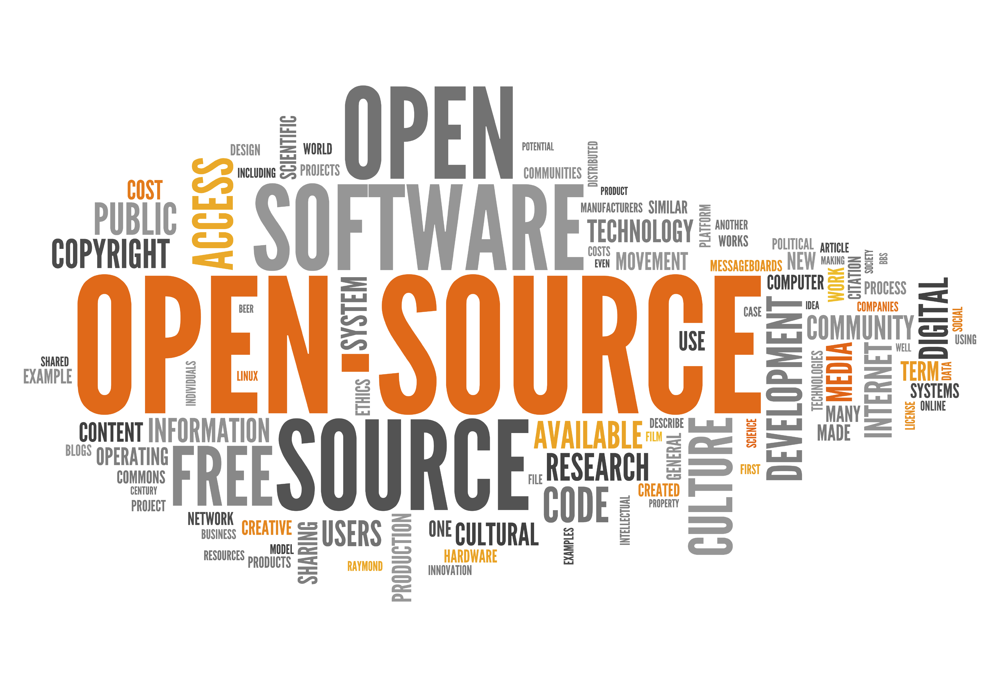
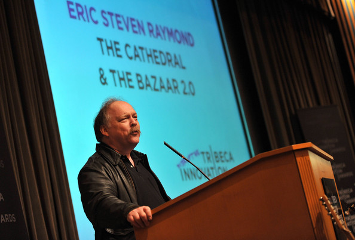
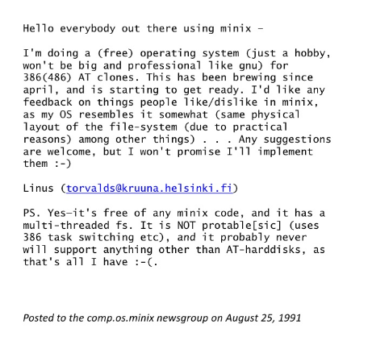
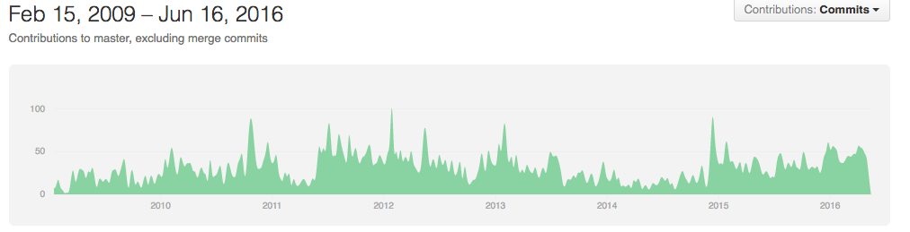

# 开源软件文化

最近一个金融行业的朋友对信息技术的发展产生了浓厚的兴趣。她在阅读[Thomas Friedman](http://www.thomaslfriedman.com/)的《[世界是平的](https://book.douban.com/subject/1867642/)》一书时，对其中的“开源软件”一词产生了巨大的疑惑，她一脸狐疑的询问我：“这些人是什么心态，把核心的技术放到网上大家随便用，为什么不拿来赚钱？！”。在“金钱至上”的金融圈，这种行为确实让人难以理解。我想通过这篇文章，让非IT圈的朋友（以及IT圈不了解开源软件的）对开源软件文化有更深的理解。文中的某些观点纯属个人意见，欢迎探讨。

## 历史
既然讲文化，当然离不开历史。历史造就了文化，文化衬托了历史。历史的发展总是由少数“关键人物”推动的，开源软件的历史也离不开几个“关键人物”。把开源软件文化和宗教文化对比（个人认为开源文化也是一种宗教文化），会发现其都有几个关键的角色：

* “主”。一般为教派的创始人，提出了基本教义，并且偏激地践行和执行。
* “传教士”。又叫布道师，有一定影响力，对教义的理解非常深刻，同时也是很好的传播者。
* “灵魂人物”。通过实践教义做出重大贡献并让教义得到极大推广的人。

下面介绍的三位开源软件名人，也是上述三种典型。

### Richard Stallman
虽然在Stallman之前开源软件思想已经在黑客中传播和流行起来，但是Stallman是第一个将自由软件作为一项“运动”提出和发起的人，可以说是开源软件教派的“创始人”。

Stallman 1953年出生于美国纽约曼哈顿地区的犹太人家庭，1971年进入哈佛大学学习，同年受聘于麻省理工学院人工智能实验室（AI Laboratory），工作在一个只使用自由软件的小组中，成为一名职业黑客。

在AI实验室工作期间，斯托曼开发了一些今后影响深远的软件，其中最著名的就是Emacs。斯托曼在AI是一名典型的黑客，是整个黑客文化的一分子。

然而进入八十年代后，黑客社群在软件工业商业化的强大压力下日渐土崩瓦解，甚至连AI实验室的许多黑客也组成了Symbolic公司，试图以专利软件来取代实验室中黑客文化的产物——可自由流通的软件。

斯托曼对此感到气愤与无奈，对Symbolic进行了一段时间的抗争。后于1983年9月27日发布了最初的声明，从1984年开始构建GNU工程，在1985年发表了著名的GNU宣言，正式宣布要开始进行一项宏伟的计划：创造一套完全自由的，向下兼容Unix的GNU操作系统（GNU's Not Unix!）。之后他又建立了自由软件基金会来协助该计划。

1989年，他与一群律师起草了广为使用的GNU通用公共协议证书，创造性地提出了“Copyleft”的概念。同时，GNU计划中除了最关键的Hurd内核之外，其他绝大多数软件已经完成。

Stallman和其他的自由软件爱好者不一样的是，他对商业软件不仅仅是嗤之以鼻，甚至到了“憎恶”的地步，他认为软件闭源是及其不道德的事情。

当然，Stallman本身也是一个彻头彻尾的技术狂人和专家，他的作品如`GNU C Compiler`，`Emacs`等现在依然被广泛使用。

Stallman在我眼中之所以可以称作“主”（主只有一个，其他都不止一个），一是因为他是第一个站出来“起义革命”的人，一直是开源软件界的旗手，二是他相对其他人对开源软件的认知更纯粹和理想化，也更富有神圣色彩。

### Eric Raymond

Raymond是典型的传教士。他自己本身不像Stallman那样偏激和理想主义，但是他最大的优势是写的一手好文章，是开源软件文化的第一散播者。

Raymond1957年出生于美国马萨诸塞州的波士顿，从小就跟随父母在世界各地东奔西走，曾在地球上三块大陆居住，在13岁之前已经忘掉了两种语言。1971年他回到美国宾夕法尼亚州，从1976年起开始接触黑客文化，1982年完成了他的第一个开放源代码软件项目。

雷蒙管理着30多个开源软件以及10多个主要的FAQ。他是INTERCAL编程语言的主要创作者之一，还曾经为EMACS编辑器的发展作出贡献。雷蒙还是Fetchmail程序的作者。最近他还编写了一个最初用于Linux内核设置的设置程序。

1997年以后，雷蒙成为了开放源代码运动的主要理论家，以及开放源代码促进会（Open Source Initiative）的主要创办人之一。他还担任了开放源代码运动对媒体、商界以及主流文化的形象大使。他是一名优秀的演说家，并曾经到过六大洲的15个国家进行演说。他的话经常被主流媒体所引用，并是所有黑客中曝光率最高的。

Raymod的“Given enough eyeballs, all bugs are shallow”是对开源软件的高质量进行说明的名言。他的很多著作如《大教堂与集市》、《Unix编程艺术》都被誉为软件界经典书籍，特别是《大教堂与集市》一书，清晰、透彻和准确地分析和描述和开源运动的理论和实际应用，被称为开源软件界的“圣经”。

### Linus Torvalds
Linus可能是当今开源软件界最出名的人了，当之无愧的灵魂人物之一。他的代表作品除了非程序员都耳熟能详的`Linux`，还有现在被广泛使用的代码仓库工具`git`。

托瓦兹出生于芬兰赫尔辛基市。1988年，他进入赫尔辛基大学计算机科学系。1989年，他进入芬兰陆军，服11个月的义务兵役，军衔为少尉，主要服务于计算机部门。1990年，他退伍后回到大学，开始接触Unix。根据安德鲁·斯图尔特·塔能鲍姆所著的教科书及minix源代码，他打造了自己的操作系统。1991年8月25日，在网络上发布了Linux内核的源代码。

1999年，Red Hat及VA Linux这两间公司，决定将他们公司的股票选择权（stock option）一部分赠与托瓦兹，以感谢他的贡献。

2003年，为了专心于Linux内核的发展，从全美达公司辞职，受聘于开源码发展实验室（OSDL），担任Linux内核的主要维护者。2005年，为了管理Linux内核的源代码，开发了Git。

2007年1月22日，自由标准组织与开源码发展实验室合并，成立了Linux基金会。Linux基金会提供薪水及各种协助，以支持托瓦兹继续投入Linux内核的开发工作。

Linus对开源软件的最大贡献不是Linux内核本身，而是Linux项目向世界证明了开源软件这种松散、自由的软件开发方式可以开发出高质量的顶级软件（甚至封闭开发的软件都没有达到的高度），并且能够及其迅速的传播和推广，成为开源软件的最典型案例。

## 开源精神

开源软件发展到现在，已经被大多数人认知和认可。这里总结下我认为的开源软件精神。

### 自由
自由这个词的英文`free`更贴合开源软件的精神，既有自由，也有免费的意思。这也是开源软件最基础的要素。

在开源软件这个词没有流行起来之前，人们提的比较多的反而是“自由软件”这个词。相对来说，自由软件比开源软件更加理想化（当然现在已经不怎么特别区分这两个名词了）。这里，自由的意思是，你可以随意下载、修改、发布开源软件和基于其的修改，无需付任何费用，也无需付任何责任。就像Linus的名言说的那样：`Software is like sex, it's better when it's free`。

自由免费，就像病毒一样，促进了开源软件的迅速传播。我们可以看到，很多开源软件的第一个版本都是比较简单和拙劣的。因为每个人都可以自由使用、提交bug（我相信没有任何商业公司有这种规模的测试人员），使得软件的质量越来越高。因为每个人都可以自由修改和再发布，软件的功能也越来越丰富。

### 分享
我认为，分享是开源软件的核心精神所在，也是开源软件参与者的核心动力所在。下面这张图相信大家已经看过无数遍：

“被尊重”、“被需要”，都是人的高级需求。我相信这也是开源软件的作者在没有任何任何直接利益的情况下坚持维护和不停改进项目的根本原因。当然，这也解释在大多数人处在满足底层需求的国家（如中国），开源软件不会发达；而大多数人都处于需要满足高级需求的国家（如北欧），开源软件十分发达。每个工程师都有一个“改变世界”的梦想，都希望着自己的代码在数以亿万的浏览器上被执行，都希望自己的代码在成千上万的服务器上被运行。开源项目就像开发者的宝宝一样，在看着宝宝出生和茁壮成长的过程中，项目影响了越来越多的人，开发者的个人成就感会得到极大满足。这也是Linus 20几年来一直耐心维护着Linux的重要原因所在。

### 社区
社区的成熟和发展，是开源软件步向成熟的标志。相信很多工程师都熟悉[SourceForge](http://sourceforge.net)这个网站，她在2000年前后非常流行：



还有巨头[google的code站](http://code.google.com)，曾经也是风火过一段时间，Google已经于16年正式关闭了该服务。

这两个网站都是以开源软件的托管和下载为中心，开发者可以公开发布和分享自己的开源项目，任何人都可以下载和使用。类似web 1.0，这时的开源软件也是1.0时代，少数内容生产者发布内容，大部分消费者被动接受内容。

[GitHub](https://github.com)的出现是开源软件进化到2.0时代的重要催化剂。GitHub认为，开源软件的关键字不应该是"Source"，而应该是"Social"。和Sourceforge等网站不同，GitHub把开源软件的重心放到了“人”，而不是“代码”。代码的使用者一直也是项目的参与者，可以随时提供bug反馈，修改建议，甚至可以直接克隆一份代码修改后提交给作者，由作者决定是否将代码合入到自己的代码库中。在这个闭环中，每一个代码的使用者都也可以给项目作出不同贡献（提问题、反馈bug、开发特性、提建议等等），参与的门槛降低了，同时在这个过程中也可以获得成就感。

GitHub的社交属性齐备，有`follow`功能，用户可以订阅感兴趣的项目或作者，同时可以`watch`项目进展，`star`收藏项目。通过star机制，优质的项目很快会通过群众的眼睛被挖掘出来。

除了GitHub这个典型的线上社区，开源软件界还有不计其数的线下社区，几乎每个流行技术都会在主要城市有线下聚会和分享会，开发者、用户们聚在一起讨论使用心得，切磋改进意见。

## How To Play
无论是个人还是公司，开源软件已经是越来越流行的软件开发讨论。这里我想结合开源软件的文化和典型案例，总结下开源软件该怎么玩。当然，很多总结来自Eric Raymond的《大教堂与集市》一书，这本书对开源软件进行了深入的分析和研究，是学习开源软件文化不可多得的经典之作。

### 为什么要开源
这是在决定开源一个项目之前，无论是公司和个人，都必须回答的问题。个人的情况比较简单，一般不会涉及太多权衡，但是对公司层面，开源并不是万能银弹，开源能带来好处，同时也有一定风险：
#### 好处
* 有助软件快速推广
* 提升技术影响力，便于吸引人才
* 提高软件质量
* 对高端用户增加可玩性和定制性
* 发展生态

#### 风险
* 向竞争对手暴露核心技术
* 如果维护不力，比较影响口碑
* 增加泄密风险（如这个[案例](http://www.wooyun.org/bugs/wooyun-2010-055438)）
* 过分的开放会造成生态的混乱（如早期的安卓）

所以在决定开源项目之前，一定要权衡好利与弊。

### 开源什么，不开源什么
Google和Facebook都是热衷开源软件的顶级互联网公司，他们的开源了无数高技术含量的核心项目，如机器学习系统、高性能分布式数据库等。但是google不开源他们的搜索引擎，facebook也不开源他们的社交网络核心。从公司层面讲，在这个问题上，也是需要慎重对待的，一般的选择是：
* 开源：不含任何业务场景的系统、工具、类库等。
* 不开源：含有产品业务逻辑的、支撑核心商业模式的系统和软件。

### 尽早发布
相对于封闭软件的“憋大招”式开发，开源软件应该尽早的发布，哪怕它不成熟（甚至只有一个idea和设计文档）。发布时只需要保证两点：

1. 项目（优雅地）解决了若干人碰到的问题
2. 项目拥有良好的设计，能够支持很多人一起贡献、开发

下面是Linux在网上发布他的第一版Linux时的邮件原稿，第一版的Linux只是一个minix的山寨版，甚至只支持386，但是Linus开放包容的心态完美的阐释了开源软件运营的一个核心原则：`放权`。

优质的开源软件不应该是几个大牛关在小黑屋里憋出来的产物，而是社区成千上万人齐心协力，你一砖我一瓦建造出来的城堡。

### 频繁发布
这里频繁发布和软件开发中的`持续集成`，和产品运营中的`快速迭代`是同样的作用：

1. 频繁的发布能够尽早在第一时间接收到反馈和意见。
2. 能够尽快的发现bug和问题。
3. 没有人比开源软件的用户更有耐心和容忍度，同时这些`测试人员`的数量非常惊人。

### 持续坚持
`NodeJS`是近几年开源软件界最成功的项目之一：

可以看到在nodejs开始获得广泛关注的11年之前的2年，作者都在默默无闻的坚持开发，从不间断。一个非大公司开发的开源软件，基本上都需要2年以上的时间才能从推出到流行。我们可以看到无数的“僵尸项目”都在远不到两年的时间停止了更新和维护，但是坚持下去的项目，都获得不错的影响。近两年流行的`Docker`也是如此：

### 如何盈利
当然，很多开源软件都不盈利（也不屑于盈利），但是对很多靠开源软件方式运作的商业公司，如何盈利是不得不研究的课题，目前出现的典型开源软件盈利模式有：

* 卖T恤、马克杯、周边、等等（呵呵）
* 商业授权。个人免费试用，商用需要购买授权。（在中国，又呵呵了）
* 建立基金会，由大公司或个人共同出资赞助项目。
* 基础功能开源免费，高级功能闭源且付费。
* 培养生态，借机推出相关产品打向市场。

## 总结 
纵观商业历史，一个产业的发展速度和其自由度密切相关。互联网正式由于其开放，自由，免费在这十几年得到了飞速发展。开源软件的开放模式和思想，必然也会一样，向病毒一样传播了扩散。Welcome to join the party!